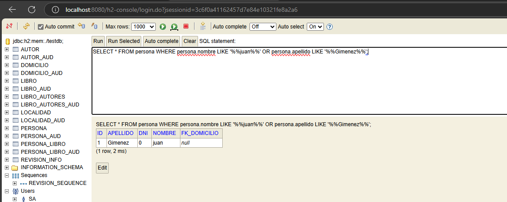
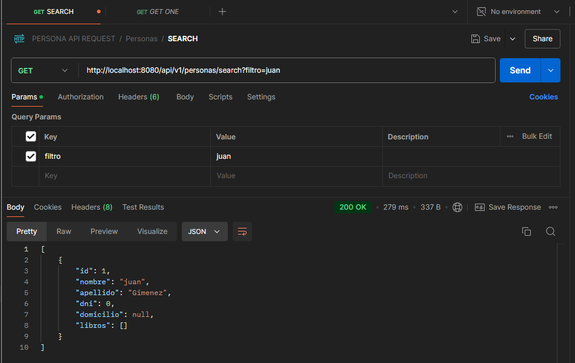
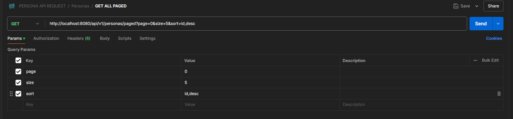

##Primer query

SELECT * FROM persona WHERE persona.nombre LIKE '%%juan%%' OR persona.apellido LIKE '%%Gimenez%%';

## API Request SEARCH

## search PAGED  

atributos->  

en los atributos donde tenemos el parametro sort, que indicamos por "id,desc" o "id,asc" para que sea ascendente o descendente 

